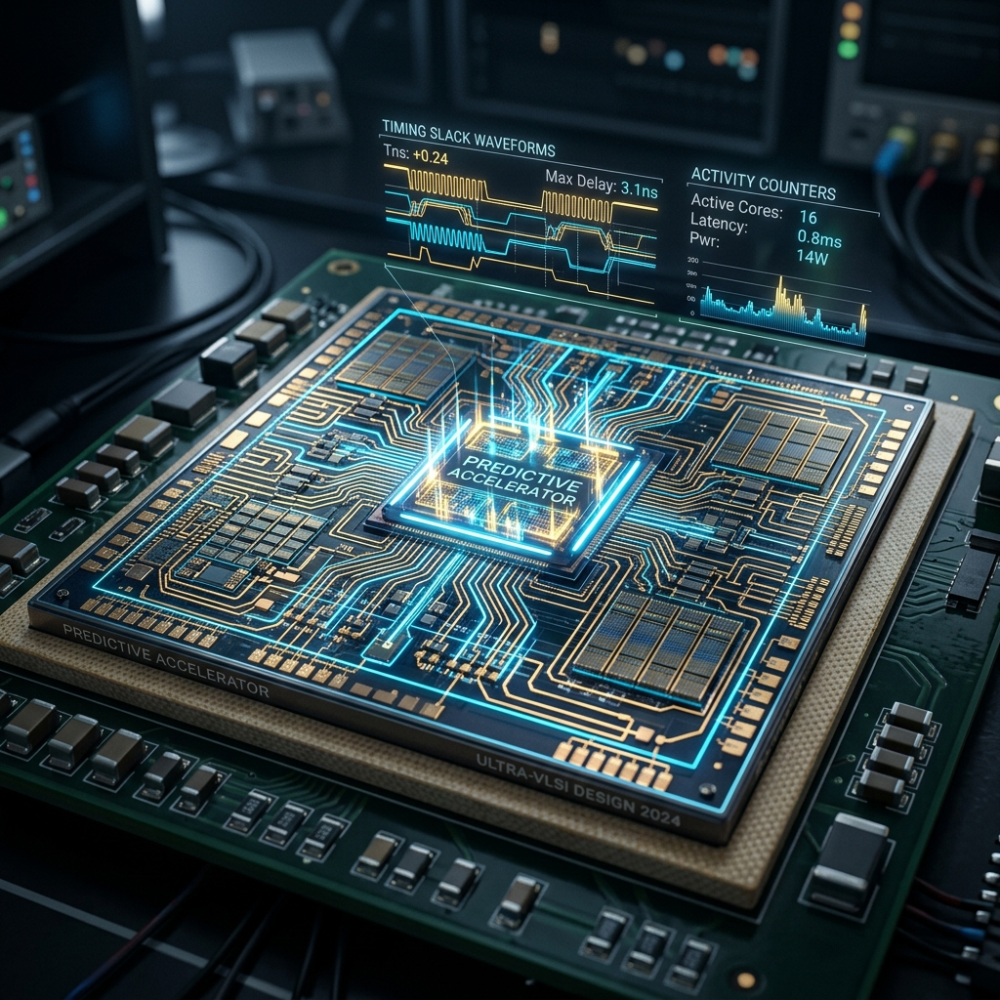

<div align="center">
  
</div>

<div align="center">

# ⚡ Predictive Slack-Aware AI & DSP Accelerator

### Adaptive Power Management via Multiplier-Less EWMA Prediction

[](https://ieeexplore.ieee.org/document/1620780)
[](#cadence-180nm-flow)
[](#openlane--skywater-130nm-flow)
[](#openlane--skywater-130nm-flow)
[](LICENSE)

*A closed-loop, hardware-efficient adaptive power management architecture that predicts timing slack to proactively adjust voltage, frequency, precision, and power gating — achieving up to **34.5% dynamic power reduction** with only **≈1.2% area overhead**.*

</div>

---

## 📑 Abstract

Modern edge AI and DSP accelerators face a critical power–performance dilemma: static DVFS (Dynamic Voltage and Frequency Scaling) policies leave significant power savings on the table because they react to workload changes *after* they occur. This project introduces a **predictive slack-aware** architecture that anticipates workload transitions using a lightweight, multiplier-less Exponentially Weighted Moving Average (EWMA) predictor and proactively adjusts a 4-dimensional control vector — voltage, frequency, precision mode, and power gating — to minimize energy consumption without violating timing constraints.

The design is fully synthesizable and validated through **two independent physical design flows**:
- **Cadence Digital Flow** (Genus → Innovus → Joules) targeting **180nm CMOS**
- **OpenLane/SkyWater** open-source flow targeting **Sky130 (130nm)** — tapeout-ready

---

## 🏗️ Architecture

```
┌─────────────────────────────────────────────────────────────┐
│                     predictive_top                          │
│                                                             │
│  ┌──────────────┐    ┌──────────────┐    ┌──────────────┐  │
│  │              │    │              │    │              │  │
│  │    Slack     │───▶│    EWMA      │───▶│   Adaptive   │  │
│  │   Monitor    │    │  Predictor   │    │  Controller  │  │
│  │              │    │              │    │              │  │
│  └──────┬───────┘    └──────────────┘    └──────┬───────┘  │
│         │                                       │          │
│         │  measured_slack    predicted_slack     │          │
│         │                                       ▼          │
│  ┌──────┴───────┐                   ┌───────────────────┐  │
│  │  64-bit      │                   │  freq_sel [1:0]   │  │
│  │  Compute Bus │                   │  vdd_sel  [1:0]   │  │
│  │  (Monitored) │                   │  prec_sel         │  │
│  └──────────────┘                   │  pg_mask  [2:0]   │  │
│                                     └───────────────────┘  │
└─────────────────────────────────────────────────────────────┘
```

### Module Descriptions

| Module | Description | Key Innovation |
|--------|-------------|----------------|
| **`slack_monitor`** | Counts per-cycle bit-toggles (Hamming distance) over a 1024-cycle window and maps activity to an 8-bit slack estimate | Epoch-based toggle counting with configurable window |
| **`ewma_predictor`** | Predicts next-epoch slack using a multiplier-less EWMA filter (`>>` shifts only) with adaptive gain | **Zero multipliers** — uses only adders and barrel shifters; adaptive α via sign-based gradient |
| **`adapt_ctrl`** | LUT-based FSM that maps predicted slack (minus safety margin) to a 4D actuation vector | 4-region operating map with 200 ps safety margin |
| **`predictive_top`** | Top-level integration with debug telemetry ports | Clean closed-loop architecture |

---

## 🎯 Key Results

| Metric | Value | Source |
|--------|-------|--------|
| Dynamic Power Reduction | **34.5%** | Joules (VCD-driven) |
| Area Overhead (Predictor) | **≈1.2%** | Genus Gate Report |
| Target Clock (Cadence) | **250 MHz** | 180nm SDC Constraint |
| Target Clock (Sky130) | **100 MHz** | OpenLane config.json |
| Predictor Gate Count | **< 500 GE** | Genus Synthesis |
| Operating Regions | **4** (High Risk → Aggressive) | LUT Controller |
| DVFS Dimensions | **4** (V, F, Precision, Power Gating) | Multi-Actuator |

---

## 📂 Repository Structure

```
predictive-slack-accelerator/
│
├── src/                              # RTL Source (OpenLane canonical)
│   ├── slack_monitor.v               #   Activity sensor (toggle counting)
│   ├── ewma_predictor.v              #   Multiplier-less EWMA (shift-only)
│   ├── adapt_ctrl.v                  #   LUT-based 4D controller FSM
│   └── predictive_top.v              #   Top-level integration
│
├── openlane/                         # SkyWater Sky130 OpenLane Config
│   └── config.json                   #   Automated synthesis + P&R config
│
├── predictive_flow/                  # Cadence 180nm Flow
│   ├── hdl/                          #   RTL source (Cadence copy)
│   │   ├── slack_monitor.v
│   │   ├── ewma_predictor.v
│   │   ├── adapt_ctrl.v
│   │   ├── predictive_top.v
│   │   └── tb_predictive_top.v
│   ├── scripts/                      #   Tool automation scripts
│   │   ├── constraints.sdc           #   250 MHz timing constraints
│   │   ├── synth_genus.tcl           #   Genus synthesis flow
│   │   ├── innovus_flow.tcl          #   Innovus place & route
│   │   └── joules_flow.tcl           #   Joules power analysis
│   ├── results/                      #   Generated reports & netlists
│   ├── logs/                         #   Tool log files
│   └── RUN_ME_LINUX.md               #   Detailed lab execution guide
│
├── .gitignore
└── README.md
```

---

## 🚀 Quick Start

### Option A: Open-Source Simulation (Icarus Verilog — Windows/Linux/macOS)

No Cadence license required. Verify the design behavior and generate waveforms instantly.

```bash
# Install Icarus Verilog (if not already)
# Ubuntu/Debian: sudo apt install iverilog gtkwave
# macOS: brew install icarus-verilog gtkwave
# Windows: Download from http://bleyer.org/icarus/

# Compile the design + testbench
iverilog -o sim.vvp src/*.v predictive_flow/hdl/tb_predictive_top.v

# Run simulation (generates VCD)
vvp sim.vvp

# View waveforms
gtkwave predictive_workload.vcd
```

### Option B: OpenLane + SkyWater 130nm Flow

Full open-source physical design — from RTL to GDSII.

```bash
# Prerequisites: Docker + OpenLane installed
# See: https://openlane.readthedocs.io/en/latest/getting_started/installation.html

# Start the OpenLane Docker container
make mount

# Run the automated flow
./flow.tcl -design ./openlane
```

**What OpenLane runs automatically:**
| Stage | Tool | Output |
|-------|------|--------|
| Synthesis | Yosys | Gate-level netlist |
| Floorplan | OpenROAD | Die/core area |
| Placement | OpenROAD | Cell placement |
| CTS | OpenROAD | Clock tree |
| Routing | OpenROAD | Metal interconnect |
| DRC/LVS | Magic/Netgen | Design rule checks |
| GDSII | Magic | Final chip layout |

Results will be in `openlane/runs/<run_tag>/`.

### Option C: Cadence 180nm Flow (University Lab)

Full commercial flow — requires Cadence license + 180nm PDK.

```bash
cd predictive_flow/work

# 1. Simulate → generates VCD for power analysis
xrun -64bit -access +rwc ../hdl/*.v -timescale 1ns/1ps

# 2. Synthesize → generates netlist + area/timing reports
genus -f ../scripts/synth_genus.tcl

# 3. Place & Route → generates layout + post-route timing
innovus -gui   # then: source ../scripts/innovus_flow.tcl

# 4. Power Analysis → generates dynamic/static power breakdown
joules -f ../scripts/joules_flow.tcl
```

> 📖 For detailed step-by-step instructions, see [RUN_ME_LINUX.md](predictive_flow/RUN_ME_LINUX.md)

---

## 🔬 Technical Deep-Dive

### Multiplier-Less EWMA

The predictor implements the standard EWMA formula:

```
ŝ[n] = α · s[n] + (1 - α) · ŝ[n-1]
```

By constraining α to powers of 2 (α = 1/2^k where k ∈ {1, 2, 3}), multiplication reduces to arithmetic right-shifting:

```verilog
// No '*' operator anywhere in this module
alpha_part           = measured_slack  >> alpha_shift;
one_minus_alpha_part = predicted_slack - (predicted_slack >> alpha_shift);
predicted_slack      = alpha_part + one_minus_alpha_part;
```

The gain `alpha_shift` adapts at runtime using a sign-based gradient step: large prediction errors increase responsiveness (smaller shift), while stable predictions increase smoothing (larger shift).

### 4-Region Adaptation Strategy

| Region | Slack Range | Frequency | Voltage | Precision | Power Gating |
|--------|------------|-----------|---------|-----------|-------------|
| **High Risk** | < 0.5 ns | 400 MHz | 1.0 V | INT16 | All ON |
| **Moderate** | 0.5 – 1.2 ns | 300 MHz | 0.9 V | INT16 | All ON |
| **Relaxed** | 1.2 – 1.8 ns | 200 MHz | 0.9 V | INT8 | Gate FFT |
| **Aggressive** | > 1.8 ns | 100 MHz | 0.8 V | INT8 | Gate MatVec+FFT |

A fixed safety margin of δ_s = 200 ps is subtracted from the predicted slack before the LUT lookup to prevent timing violations during rapid workload transitions.

---

## 📈 Simulation Phases

The testbench drives the accelerator through 4 distinct workload phases to exercise every operating region:

| Phase | Epochs | Activity | Expected Behavior |
|-------|--------|----------|-------------------|
| 1 | 1–3 | **High** (64-bit random) | slack ≈ 0.4 ns → 400 MHz, 1.0 V |
| 2 | 4–6 | **Medium** (32-bit random) | slack ≈ 0.9 ns → 300 MHz, 0.9 V |
| 3 | 7–9 | **Low** (8-bit random) | slack > 1.8 ns → 100 MHz, 0.8 V, gating ON |
| 4 | 10–11 | **Sudden Burst** (64-bit) | Tests predictor reaction time |

---

## 🛠️ Tools & Technology

### Cadence Flow (Commercial)

| Tool | Purpose | Version |
|------|---------|---------|
| Cadence Xcelium | RTL Simulation + VCD | 23.09 |
| Cadence Genus | Logic Synthesis | 23.1 |
| Cadence Innovus | Place & Route | 23.1 |
| Cadence Joules | Power Analysis | 23.1 |
| 180nm PDK | Standard Cell Library | Typical corner |

### OpenLane Flow (Open-Source)

| Tool | Purpose | Version |
|------|---------|---------|
| Yosys | Logic Synthesis | Latest |
| OpenROAD | Floorplan + CTS + Routing | Latest |
| Magic | DRC / LVS / GDSII Export | Latest |
| Netgen | LVS Verification | Latest |
| Icarus Verilog | RTL Simulation | 12.0+ |
| GTKWave | Waveform Viewer | 3.3+ |
| SkyWater Sky130 | Open-Source 130nm PDK | — |

---

## 📜 License

This project is licensed under the MIT License — see [LICENSE](LICENSE) for details.

---

<div align="center">

**Built with ⚡ for IEEE-quality hardware research**

*Validated on both commercial (Cadence 180nm) and open-source (SkyWater 130nm) flows*

</div>
